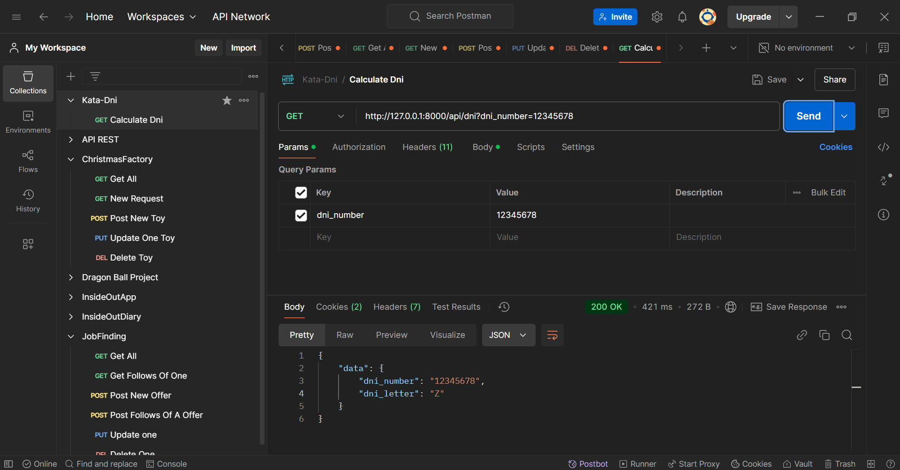
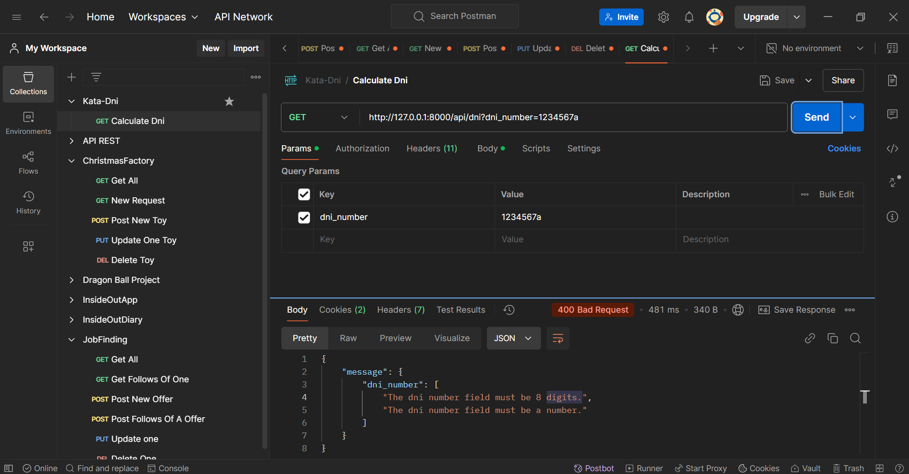

# 🪪Kata-Dni
The objetive of this proyect is to calculate the letter of a Dni with only the numbers.

In this project I used Mysql but fell free to change it in the .env.example

The entire operation of this project is based on API

---

# 📖OVERVIEW

The number of the Dni must be a number of 8 digits between: 00000000 and 99999999.

🌄Let see the results on Postman:

This is the correct response:

This is the response if you don´t fill the content with any number:

This is the response if you put any letter on the 8 digits number:

This is the response if there is no letter on the database for that number:

# ⚙️Instalation requiremets
To try this project on local you will need:

    1. PowerShell (or any other terminal).
    2. Xampp (or any other database manager).
    3. Xdebug (for the test coverage).
    4. Postman (or any other API tester).
    5. Node.js.
    6. Composer.
## ⚙️Instalation

### 1. Clone the repository:
    https://github.com/Kalixto73a/Kata-Dni.git
### 2. Install Composer: 
    composer install
### 3. Install NPM:
    npm install
### 4. Generate Key:
    php artisan key:generate
### 5. Change the file .env.example to .env and fill the database credentials:
    DB_CONNECTION=(anyone you want or leave it on mysql)
    DB_DATABASE=(anyone you want or leave it on dni)
### 6. Create Database: 
    php artisan migrate
### 7. Generate all tables and fill it: 
    php artisan migrate:fresh --seed
### 8. Run NPM:
    npm run dev
### 9. Run the server (in other terminal):
    php artisan serve

## 🗂️Database diagram:
### This is the database diagram, is very simple and is only used to store the dni letters.

## 🌐Endpoints:
### In this project we only have 1 endpoint
    GET http://127.0.0.1:8000/api/dni
| Parameter | Type     | Description                |
| :-------- | :------- | :------------------------- |
| `dni_number`| `numeric` | **Required**. Number of the DNI |
### Response:
- #### Status Code: 200

### 💀Test:

#### You can try this tests with:
    php artisan test --coverage

#### This project has a 100% of test coverage.

## 🛠️Tech and Tools:

## 👩‍💻Authors
### - [Alvaro Cervera Vigara](https://github.com/Kalixto73a)
